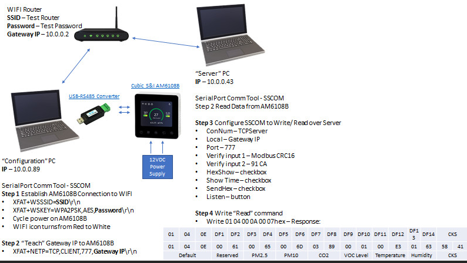

# Estaciones de monitoreo

Dentro de las instalaciones de ESFM-IPN, se encuentran montadas las estaciones de monitoreo ambiental que constan de sensores AM6108B con la capacidad de medir partículas y moléculas como son PM2.5, CO2, temperatura y humedad. La información detallada del funcionamiento físico de los sensores se encuentra en el mismo [manual del sensor](https://correoipn-my.sharepoint.com/:b:/g/personal/alaral_ipn_mx/EbNhI-d-q61Ikn6XXtcKFywBFhhukJWF1IJH-axWjLtDFw?e=USovdG).


Cada uno de los sensores se instalaron de manera estratégica para cubrir las zonas con mayor afluencia de estudiantes, docentes y personal administrativo de la escuela; con el objetivo de monitorear la influencia que tiene el tráfico del personal de la escuela respecto a variables ambientales.

## Parámetros atmosféricos

De acuerdo con el manual del sensor, aunque los sensores montados solo miden PM2.5, C02, temperatura y humedad, están configurados de fábrica para que la información que devuelva sea de todos sus productos aún cuando sean de diferente versión, por lo que la información codificada devuelve las siguientes variables ambientales con sus respectivas tolerancias y unidades:

* pm25,pm10 son las partículas por millón y sus unidades son $\mu$g/m³ con precisión PM2.5: 0~100$\mu$g/m³, ±10$\mu$g/m³; >100$\mu$g/m³, ±10% de lectura (25°C±2°C, 50±10%RH)
* CO2 es el dióxido de carbono y sus unidades son ppm con precisión ±(50ppm+5% of reading) /±(30ppm+3% of reading)
* VOC es un índice de químicos tóxicos que puede detectar en paredes y sus unidades son  $\mu$g/m³ con precisión no encontrada entre el manual o internet.
* TMP es la temperatura y sus unidades están en Kelvin con precisión ±1°C(0°C ~50°C)
* HM es la humedad y sus unidades están en RH con precisión ±8%(0%~95%RH)
* CKS es el reloj interno de los sensores

Donde para PM10 y VOC la información codificada siempre la devolverá como 0

\newpage

## Diagrama de instalación de sensores




Más adelante se explica de manera detallada los pasos mencionados de la Figura 1.2, del diagrama los siguientes componentes fueron los que se utilizaron:

* WiFi Router
	- SSID: "WiFi-IPN " -> Es importante agregar el espacio.
	- Password: "any" -> Cualquier carácter
* Configuration PC
	- OS: Linux (De preferencia basado en Debian)
* Server PC
	- OS: Raspberry Pi 3, patana

Lo que ocurre con el Server PC es que la Raspberry Pi 3 funciona como un servidor puente que ayuda a recolectar los datos conectado desde la red WiFi IPN y reenviarlos hacia la patana que se encuentra conectada en otra red privada. La Configuration PC solo se necesita la primera vez que se configura los sensores, ya que se encuentran configurados, no es necesario tener la computadora conectada hacia el sensor.

Debido a que nosotros configuramos multiples sensores conectados a un mismo router, se decidió configurar cada uno de ellos en diferentes puertos organizados de la siguiente manera:

| Puerto | Sigla  | Ubicación                                      |
|--------|--------|------------------------------------------------|
| 555    | SI9    | Dep.Investigación Edif 9                       |
| 666    | S107E9 | Salón 107 Edif 9                               |
| 888    | I102E9 | Salón enfrente de Dep.Investigación 102 Edif 9 |
| 777    | P107E9 | Pasillo enfrente de salón 107 Edif 9           |
| 999    | S111E9 | Salón 111 Edif 9                               |
| 444    | P111E9 | Pasillo 111 Edif 9                             |
| 222    | NULL   | Computación Edif Z                             |


# Configuración de sensores

## Configuración de una ip fija para el Raspberry Pi 3

Para que los sensores envién los datos hacia la raspberry, necesitan de una ip a la cual mandar los paquetes de información, es por esto que se debe de configurar una ip fija asociada a la raspberry conectada hacia el mismo router a la que se conectan los sensores. Estos son los siguientes pasos para configurar la ip fija:

1. Comprobar si DHCP está habilitado
	```
	sudo service dhcpcd status
	```
2. En caso de que no, correr los siguientes comandos:
	```
	sudo service dhcpcd start
	sudo systemctl enable dhcpcd
	```
3. Una vez habilitado DHCP, abrir el archivo de configuración en la ruta /etc/dhcpcd.conf
	```
	sudo vi /etc/dhcpcd.conf
	```
4. Agregar las siguientes líneas, donde la ip fija será la línea `static ip_address`
	```
	interface wlan0 
	static ip_address=192.168.12.42/24
	static routers=192.168.0.1
	static domain_name_servers=192.168.0.1
	```
5. Reiniciar la raspberry
	```
	sudo reboot
	```

## Configuración de conexión de sensores hacia el router

Con ayuda de una computadora que funja como la "Configuration PC" de la Figura 1.2 con Linux (basado en Debian) o una VM con permisos de lectura y escritura hacia los puertos USB de la computadora, un USB-RS485 con cables o de preferencia jumpers conectados en los pines A y B; podemos realizar la configuración de los sensores con los siguientes pasos:

1. Con el sensor prendido, conectar los jumpers desde el RS485 pines A y B hacia los respectivos pines A y B del sensor.
2. Realizar las configuraciones al script de bash `connect.sh` en la línea que contenga `XFAT+NETP=TCP,CLIENT,888,192.168.12.42` cambiando el puerto 888 por el puerto deseado y asegurando que la ip dentro del script `192.168.12.42` sea la misma ip fija configurada en la Raspberry Pi 3. Asegurar que el WSSID, WSKEY estén correctos.
3. Abriendo una terminal en la ubicación del script, correr el script con privilegios de sudo `sudo bash connect.sh`.
4. Desconectar y conectar de la corriente el sensor y esperar a que el símbolo de conexión pase de azul a blanco, con esto aseguramos que el sensor está conectado al router configurado.

## Envió y recepción de datos desde los sensores

Esta sección se encuentra totalmente automatizada sin embargo se explicará la manera en la que se recolectan y envían los datos.

En la raspberry se encuentran los scripts `command*.sh` donde cada uno de ellos envía una petición hacia tres sensores con los puertos asignados a través de la cadena hexadecimal "01 04 00 0A 00 07 91 CA" que para los sensores un comando para envío de todas sus mediciones realizadas de las distintas variables meteorológicas al momento. Después, la raspberry escucha a través del puerto hasta encontrar alguna respuesta de los sensores durante 15 min, y envía la información recolectada hacia el archivo `datos.csv`.

Luego, cada hora, la raspberry ejecuta el script `sendsh.sh` que manda el archivo `datos.csv` hacia la patana donde se procesa y decodifica toda la información.

Estas tareas se configuraron con la herramienta de crontab, por lo que si se requiere visualizar o editar las tareas, basta con correr el comando 

```
crontab -e
```

Ahí mismo se puede configurar el tiempo de ejecución de cada tarea.

## Procesamiento de información

Para decodificar los datos enviados a los sensores, basta con interpretar cada par de número como un hexadecimal que contiene la información detallada en el diagrama de la Figura 1.2. Para esto basta con correr el script `decode.sh` ubicado en la patana dentro del usuario `jperalta` que decodifica cada hexadecimal, agregando fecha y lugar de la medición hacia el archivo `decodeData.csv`

# Mejoras al monitoreo de estaciones

1. Se puede mejorar la manera en la que se realiza la petición de la raspberry hacia los sensores, cambiando el tiempo en el que se envían los paquetes de información para que los sensores alcancen a escuchar la petición sin estar 15 min realizando la misma petición hasta obtener respuesta alguna de los sensores.
2. Se conjetura que el servidor puente de la raspberry pi no es necesaria pues al final del día la patana se encuentra conectada hacia la misma red en la que está WiFi IPN pero sin estar en una red pública.
3. Cuando la escuela tiene cortes de luz, se corre el riesgo de que la ip fija configurada la ocupe otro dispositivo antes que la raspberry pi, para esto solo queda esperar a que el otro dispositivo se desconecte de la red o configurar una nueva ip fija, sin embargo la última opción conlleva a también configurar todos los sensores hacia la nueva ip fija de la raspberry.

# Códigos de scripts

## Connect.sh

``` connect.sh
#! /bin/bash

a=$(lsusb | grep QinHeng | awk '{print $6}' | awk -F : '{print $1}') 
b=$(lsusb | grep QinHeng | awk '{print $6}' | awk -F : '{print $2}') 

echo "${a}"
echo "${b}"
sudo modprobe usbserial vendor=0x$a product=0x$b
echo 'Configure succesfully!'

stty -F /dev/ttyUSB0 9600 
sleep 2s
echo 'XFAT+WSSSID=WiFi IPN ' > /dev/ttyUSB0;
sleep 2s
echo 'XFAT+WSKEY=WPA2PSK,AES,nopreguntes' > /dev/ttyUSB0;
sleep 2s
echo 'XFAT+NETP=TCP,CLIENT,888,192.168.12.42' > /dev/ttyUSB0;
```

\newpage

## Command.sh

``` command.sh
#! /bin/bash

port1=777
port2=888

flag=0
n=1
a=$(lsof -i tcp:$port1 | grep LISTEN | awk '{print $2}')
b=$(lsof -i tcp:$port2 | grep LISTEN | awk '{print $2}')

s1='S109E9'
s2='S103E9'
s3="P1E9"

while [ ! -s msg1 ] || [ ! -s msg2 ]
do
        rm msg1
        rm msg2
        if [[ $flag -eq 0 ]]; then
                echo "01 04 00 0A 00 07 91 CA" | xxd -r -p | nc -l -v $port1 > msg1 &
                echo "01 04 00 0A 00 07 91 CA" | xxd -r -p | nc -l -v $port2 > msg2 &
        elif [[ $flag -eq 1 ]]; then
                echo "01 04 00 0A 00 07 91 CA" | xxd -r -p | nc -l -v $port1 > msg1 &
        elif [[ $flag -eq 2 ]]; then
                echo "01 04 00 0A 00 07 91 CA" | xxd -r -p | nc -l -v $port2 > msg2 &
        fi

        sleep 3s

        fuser -k 777/tcp 
        fuser -k 888/tcp 

        if [ -s msg2 ]; then
                cp msg2 msg2.tmp
                flag=1
        elif [ -s msg1 ]; then
                cp msg1 msg1.tmp
                flag=2
        fi

        n=$(($n+1))
        echo "$n"
        if [[ $n -eq 10 ]]; then
                flag=1
                break;
        fi
        [ -s msg1 ] && [ -s msg2 ] && break;
done

xxd msg1
xxd msg2

if [[ $flag -eq 0 ]]; then
        xxd msg1.tmp | awk '{print $2,$3,$4,$5,$6,$7,$8,$9}' | tr -d \. | awk '{printf $0}' | tr -d '[:space:]' | awk '{print substr($1,1,38)}' >> datos.csv
        xxd msg2.tmp | awk '{print $2,$3,$4,$5,$6,$7,$8,$9}' | tr -d \. | awk '{printf $0}' | tr -d '[:space:]' | awk '{print substr($1,1,38)}' >> datos.csv
elif [[ $flag -eq 1 ]]; then
        echo '00000000000000000000000000000000000000' >> datos.csv
        xxd msg2.tmp | awk '{print $2,$3,$4,$5,$6,$7,$8,$9}' | tr -d \. | awk '{printf $0}' | tr -d '[:space:]' | awk '{print (substr($1,1,38) "P1E9")}' >> datos.csv
elif [[ $flag -eq 2 ]]; then
        xxd msg1.tmp | awk '{print $2,$3,$4,$5,$6,$7,$8,$9}' | tr -d \. | awk '{printf $0}' | tr -d '[:space:]' | awk '{print substr($1,1,38)}' >> datos.csv
        echo '00000000000000000000000000000000000000' >> datos.csv
else

        a='00000000000000000000000000000000000000' 
        echo $a+$s1 >> datos.csv
        echo '00000000000000000000000000000000000000' >> datos.csv
        echo '00000000000000000000000000000000000000' >> datos.csv
fi

rm msg1
rm msg2
```

\newpage

## Sendsh.sh

``` sendsh.sh
#! /usr/bin/expect

spawn scp datos.csv jperalta@patana.esfm.ipn.mx:
expect "password"
send "jperalta\r"
interact
```

\newpage

## Dedode.sh

``` decode.sh
cat datos.csv | tr "+" "," | awk -F, '$1!=""' > cleandatos.csv # limpieza de datos
N=$(wc -l cleandatos.csv | awk '{print $1}') # conteo de renglones

echo "pm25,pm10,CO2,VOC,TMP,HM,cks,lugar,fecha" > decodeData.csv

for i in $(seq 0 $N)
do
        data=$(cat cleandatos.csv | awk -F, -v var=$i 'FNR == var {print $1}')
        remain=$(cat cleandatos.csv | awk -F, -v var=$i 'FNR == var {print $2,$3}' | tr " " "," )
        val=$(echo ${data:0:2})

        pm25=$(echo "obase=10; ibase=16; "$(echo ${data:10:4} | tr [a-z] [A-Z])"" | bc)
        pm10=$(echo "obase=10; ibase=16; "$(echo ${data:14:4} | tr [a-z] [A-Z])"" | bc)
        co2=$(echo "obase=10; ibase=16; "$(echo ${data:18:4} | tr [a-z] [A-Z])"" | bc)
        voc=$(echo "obase=10; ibase=16; "$(echo ${data:22:4} | tr [a-z] [A-Z])"" | bc)
        temp=$(echo "obase=10; ibase=16; "$(echo ${data:26:4} | tr [a-z] [A-Z])"" | bc)
        hum=$(echo "obase=10; ibase=16; "$(echo ${data:30:4} | tr [a-z] [A-Z])"" | bc)
        cks=$(echo "obase=10; ibase=16; "$(echo ${data:34:4} | tr [a-z] [A-Z])"" | bc)

        if [ $val == "01" ]
        then
                echo $pm25,$pm10,$co2,$voc,$temp,$hum,$cks,$remain >> decodeData.csv
        fi
done
```

Para crear el pdf de este markdown correr el siguiente comando:

```
pandoc OSWA-exam-report-template_OS_v1.md \                        
-o EnvironmentSensor.pdf \
--from markdown+yaml_metadata_block+raw_html \
--template eisvogel \
--table-of-contents \
--toc-depth 6 \
--number-sections \
--top-level-division=chapter \
--highlight-style breezedark \
--resource-path=.:src
```

